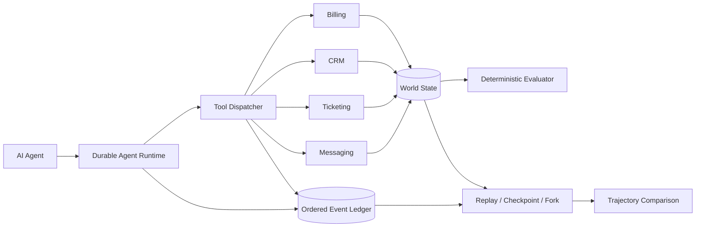

<div align="center">

# Twinwright

**Executable digital twins for testing autonomous AI agents before production.**

Stateful software worlds, durable execution, deterministic evaluation, replay, and counterfactual forks for agent reliability engineering.


</div>

---

## Why Twinwright

Autonomous agents do more than generate text. They call tools, mutate business state, retry failed operations, cross service boundaries, and continue after partial failures.

Traditional mocks are good at returning canned responses. They are much less useful for answering questions like:

- Did the agent refund the right charge?
- What happens if the refund commits but the response is lost?
- Can execution resume after a crash without duplicating side effects?
- Did a transient failure change the agent's trajectory?
- Can the exact run be reconstructed and verified?
- What changes if execution forks from an earlier checkpoint?

Twinwright provides **isolated, stateful software environments** where those behaviors can be tested without touching production systems.

## What Twinwright does

Twinwright turns API contracts plus explicit behavior definitions into executable local worlds that agents can interact with through normal tool calls.

A run can:

- create a deterministic world from a seed
- expose stateful tools to an agent
- record model and tool activity in an ordered event ledger
- commit local side effects atomically
- make repeated tool calls idempotent by stable call ID
- inject controlled failures
- pause and resume durable execution
- evaluate final state against deterministic ground truth
- replay a completed run in an isolated world
- restore valid execution checkpoints
- fork a run and change future model or fault conditions
- compare parent and forked trajectories

The project includes a minimal billing world and a multi-service company world spanning billing, CRM, ticketing, and messaging.

## Architecture



World construction is intentionally explicit:

```text
OpenAPI contracts
      +
behavior bindings
      +
world definition
      ↓
Twinwright compiler
      ↓
versioned world manifest
      ↓
isolated executable world
```

OpenAPI defines **callable shapes**, not business semantics. Twinwright keeps those concerns separate instead of pretending an API schema can infer real application behavior.

## Quick start

### Requirements

- Go 1.27 or newer
- No API key for deterministic scripted runs
- An OpenAI API key only for live model runs

Clone the repository and run the full test suite:

```bash
go test ./...
```

Build the multi-service company world:

```bash
go run ./cmd/twinwright build-world examples/company/world.yaml \
  --out company.world.manifest.json
```

Run the deterministic incident scenario:

```bash
go run ./cmd/twinwright run company-incident \
  --agent scripted \
  --manifest company.world.manifest.json \
  --db company.db \
  --seed 42
```

The company scenario requires the agent to investigate customer state across services, determine whether a duplicate charge exists, perform the justified refund, update CRM, and escalate through ticketing and messaging when incident evidence requires it.

## Inspect and verify a run

Use the returned run ID:

```bash
go run ./cmd/twinwright inspect <run-id> --db company.db

go run ./cmd/twinwright replay <run-id> \
  --manifest company.world.manifest.json \
  --db company.db
```

`inspect` exposes persisted execution state, ledger events, lineage, and deterministic evaluation results.

`replay` reconstructs the run in an isolated world using the recorded assistant decisions. It makes no model call and does not mutate the source database. Twinwright compares semantic events, saved tool results, transcripts, and final world state to detect divergence.

## Checkpoints and counterfactual forks

Twinwright can reconstruct valid restore boundaries from a durable execution:

```bash
go run ./cmd/twinwright checkpoints <run-id> \
  --manifest company.world.manifest.json \
  --db company.db
```

Fork from a committed event boundary:

```bash
go run ./cmd/twinwright fork <run-id> \
  --at-event <event-seq> \
  --manifest company.world.manifest.json \
  --db company.db
```

The child receives an isolated world and explicit lineage back to the parent. Everything before the fork remains fixed while future execution can change.

For example, continue with a different fault configuration or model:

```bash
go run ./cmd/twinwright fork <run-id> \
  --at-event <event-seq> \
  --fault createRefund \
  --steps 20 \
  --manifest company.world.manifest.json \
  --db company.db
```

Then compare the two trajectories:

```bash
go run ./cmd/twinwright compare <parent-run-id> <child-run-id> \
  --db company.db
```

This makes Twinwright useful not only for testing whether an agent failed, but for investigating **how changes in execution conditions alter downstream behavior**.

## Live model execution

Twinwright includes an OpenAI Responses API provider with function tools.

Set your API key outside the repository:

```bash
export OPENAI_API_KEY="..."
```

Then run a live agent:

```bash
go run ./cmd/twinwright run company-incident \
  --agent openai \
  --manifest company.world.manifest.json \
  --db company.db
```

Use `OPENAI_MODEL` or `--model` to select a model.

Live model behavior is nondeterministic. Twinwright's world state, tool execution, recorded decisions, and deterministic evaluators provide the reproducible boundary around it.

## Engineering guarantees

Twinwright is designed around a small set of explicit runtime invariants.

### Isolated worlds

Runs may begin from the same seed while retaining completely separate mutable state.

### Deterministic initialization

The same compatible manifest and seed reproduce the same initial fictional world.

### Atomic local effects

A mutating tool call commits its state change, mutation event, saved result, and execution progression as one local transaction.

### Idempotent retries

A committed tool call can be retried with the same call ID and request without repeating the side effect. Reusing that call ID with different arguments is rejected.

### Durable execution

Model requests, model responses, tool activity, execution status, and state mutations are persisted so interrupted runs can be inspected and resumed.

### Ground-truth evaluation

Twinwright evaluates persisted world state. It does not trust an agent simply because the agent claims the task succeeded.

### Source-safe replay

Verification replay uses an isolated reconstruction and leaves the source run database unchanged.

### Explicit capability boundaries

Unsupported schemas, routes, behaviors, manifests, and replay conditions fail explicitly instead of silently falling back to fake behavior.

## Stateful company world

The reference company world composes four services:

| Service | Example state and actions |
| --- | --- |
| **Billing** | customers, invoices, charges, refunds |
| **CRM** | accounts, notes, account status |
| **Ticketing** | issues, comments, workflow state |
| **Messaging** | channels, members, messages |

The services share one logical world but retain explicit domain behavior.

Example scenarios include:

- duplicate charge with incident escalation
- routine duplicate charge without escalation
- legitimate charge with no refund

The evaluator checks persisted outcomes, including required actions and prohibited unrelated mutations.

## Defining worlds

A versioned world definition can compose multiple service contracts:

```yaml
version: 1
name: company

services:
  billing:
    openapi: services/billing.openapi.yaml
    bindings: services/billing.bindings.yaml

  crm:
    openapi: services/crm.openapi.yaml
    bindings: services/crm.bindings.yaml

  ticketing:
    openapi: services/ticketing.openapi.yaml
    bindings: services/ticketing.bindings.yaml

  messaging:
    openapi: services/messaging.openapi.yaml
    bindings: services/messaging.bindings.yaml
```

Behavior remains explicit and registered in Go. This keeps simulations auditable and prevents the compiler from inventing business semantics that are not present in an API contract.

See `examples/company/world.yaml` and the architecture decision records in `docs/adr/`.

## Event model

Twinwright records an ordered run-scoped ledger containing execution events such as:

```text
execution.started
model.request
model.response
tool.request
tool.response
state.mutation
error
retry
execution.paused
execution.completed
```

Stable event ordering and persisted tool results provide the foundation for recovery, replay, checkpoint reconstruction, forking, and trajectory comparison.

## Repository layout

```text
cmd/twinwright/       CLI

internal/
  agent/              provider boundary and durable runner
  behavior/           behavior registry
  billing/            billing simulation
  crm/                CRM simulation
  ticketing/          ticketing simulation
  messaging/          messaging simulation
  compiler/           API and world compilation
  dispatch/           validated tool execution
  store/              SQLite state, ledger, and transactions
  eval/               deterministic scenario evaluation
  replay/             verification replay
  checkpoint/         checkpoint discovery and reconstruction
  fork/               fork execution and trajectory comparison

examples/
  billing/            minimal stateful reference world
  company/            multi-service company world

docs/adr/             architecture decision records
```

## Design philosophy

Twinwright favors difficult systems guarantees over feature count.

The project intentionally prioritizes:

- state and consequences over canned mocks
- deterministic verification over LLM judging
- explicit behavior over inferred magic
- transactional safety over optimistic retries
- reproducibility over opaque agent traces
- small testable interfaces over framework-heavy abstractions
- honest limitations over unsupported claims

The billing world remains a deliberately small reference implementation even as richer worlds are added.

## Building on Twinwright

Twinwright is intended as infrastructure for work such as:

- autonomous-agent reliability testing
- tool-use evaluation
- long-horizon workflow testing
- failure and recovery experiments
- regression testing across model versions
- cross-service agent evaluation
- execution replay and debugging
- counterfactual trajectory analysis
- safe experimentation before production deployment

Capabilities are versioned with the runtime and world manifest. The CLI and ADRs are the source of truth for exact supported behavior in a given revision.

## Development

Run tests:

```bash
go test ./...
```

Run the original billing reference example:

```bash
go run ./cmd/twinwright build examples/billing/openapi.yaml

go run ./cmd/twinwright run duplicate-charge \
  --agent scripted \
  --seed 42 \
  --fault listCharges \
  --steps 3
```

Resume and inspect:

```bash
go run ./cmd/twinwright resume <run-id> --agent scripted
go run ./cmd/twinwright inspect <run-id>
go run ./cmd/twinwright replay <run-id>
```

The default SQLite database is `twinwright.db` and is ignored by Git.

## Architecture decisions

Major runtime contracts are documented as ADRs under `docs/adr/`, including:

- Go and SQLite runtime
- OpenAPI plus explicit behavior bindings
- atomic tool effects and checkpoints
- isolated verification replay
- multi-service company world
- versioned world definitions
- checkpoint reconstruction and execution forks

The ADRs document not only what Twinwright does, but why the implementation makes those tradeoffs.

## Safety and scope

Twinwright's included worlds are fictional local simulations.

The project does not require production credentials for its deterministic examples and does not connect to real billing, CRM, ticketing, or messaging systems by default.

Keep provider credentials outside the repository.

## License

Apache License 2.0. See [LICENSE](LICENSE).
