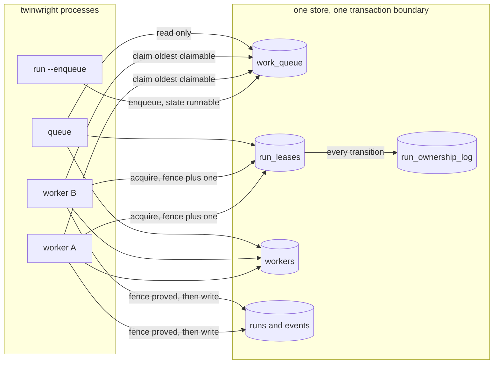
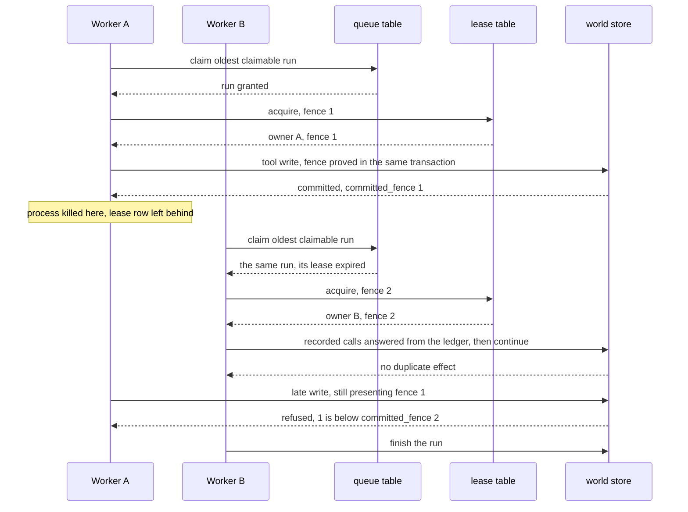
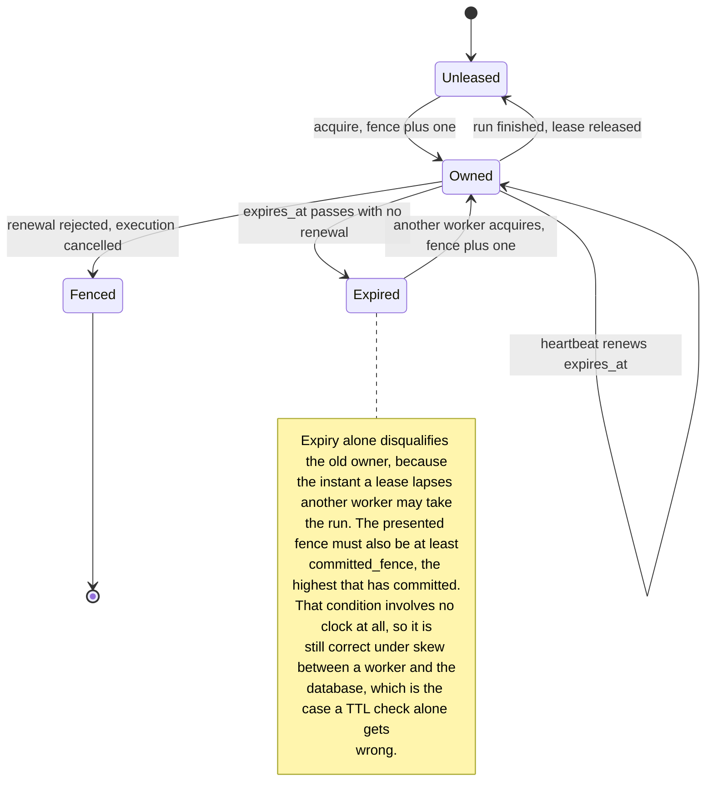

# The distributed runtime

Twinwright runs one incident on one process by default. It can also run a fleet
of workers over one database, which is what makes crash recovery something the
project measures rather than describes. This page is the picture of that, and
every database identifier below is checked against the schema by
`TestDistributedDiagramsNameOnlyRealSchemaIdentifiers` in
`internal/store/diagrams_test.go`, so a renamed table breaks the diagram that
names it.

What this is: a multi-worker runtime over one database. What it is not: a
multi-region system, a broker, or a shard map. ADR 0020 records why a broker was
rejected, since the queue needs claim-one-row-atomically and
take-over-on-expiry, which PostgreSQL provides in the same transaction as the
lease.

## Topology

`twinwright run --enqueue` queues a run. `twinwright worker` claims, executes
and finishes runs. `twinwright queue` reports depth, fleet and ownership, and
writes nothing.



A worker claims the oldest run that is runnable, or one marked leased whose
lease has expired, which is exactly what a killed process leaves behind.
Recovery needs no janitor: the next poll picks the run up. On PostgreSQL the
candidate row is taken with `FOR UPDATE ... SKIP LOCKED`, so simultaneous
pollers take different runs instead of contending. SQLite has a single writer,
so the transaction alone provides that exclusion.

Ownership history is in `run_ownership_log`, not in the run's ledger. Fork
lineage and checkpoint reconstruction digest a run's event prefix, so if
ownership transitions lived there an identical agent trajectory would digest
differently depending on which worker executed it and how often the lease
changed hands. Keeping the ledger a pure record of what the agent did is what
lets a distributed run and a single-node replay produce byte-identical ledgers.

## A worker dies mid-run

Delivery is at-least-once. Exactly-once delivery is not claimed anywhere in
this codebase, because it is not achievable across a process boundary and a
database. The effect is made idempotent instead: the dispatcher looks up the
call by its identifier before executing, and a repeated call returns the
recorded status and body while committing nothing. The same identifier with
different arguments is refused rather than answered from the cache, so a cache
hit can never stand in for a different request.



The last two exchanges are the ones worth reading twice. A stalled worker that
wakes up and writes is the failure a lease alone does not prevent, and the
refusal is why a duplicate delivery is safe rather than merely unlikely. The
project's bench suite injects exactly this: `examples/bench/flagship.yaml`
crashes the first worker at three points in a sixteen-call trajectory and
requires a takeover, a duplicate delivery and a refused stale commit on each.

## The lease, and why the clock is not trusted



Every acquisition increments the fence, including re-acquisition by the same
owner. A worker that lost contact and reconnected must not keep using its old
token, because the run may have been taken over and handed back in between.

While a run executes the worker renews on a timer, and a rejected renewal
cancels the execution context immediately. Continuing would spend model calls on
work this worker is no longer permitted to commit.

## Seeing it happen

```
twinwright bench --suite-file examples/bench/flagship.yaml
twinwright queue --dsn <dsn>
twinwright demo --dir <dir>     # step 8 crashes a worker and shows the takeover
```

The crash tests advance a controlled clock past the lease TTL rather than
sleeping it out, so the whole distributed section of the demo finishes in about
half a second. Every recovered run is replayed and required to verify, which is
what makes "byte-identical ledgers" a measurement instead of a claim.
